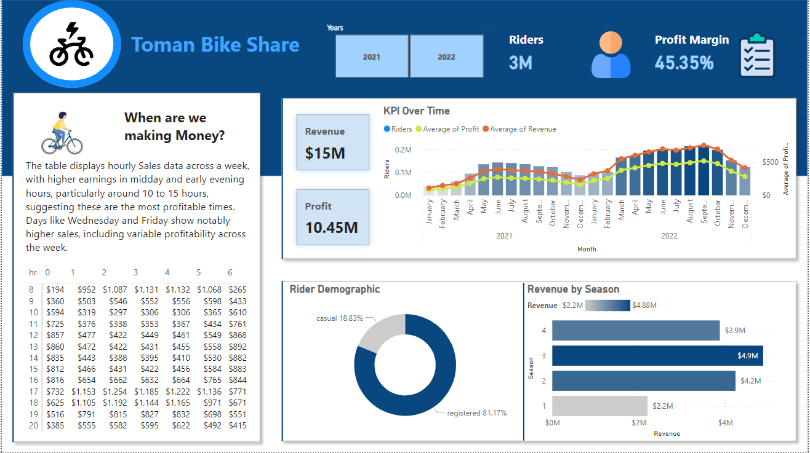
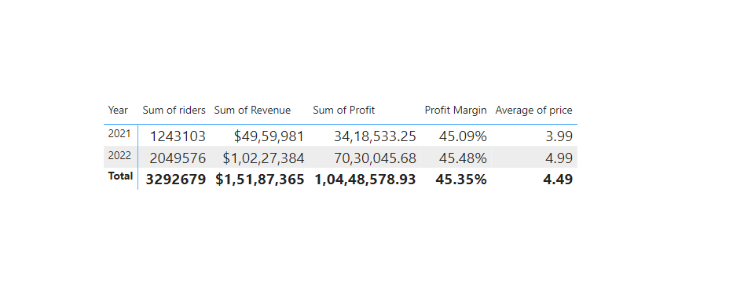
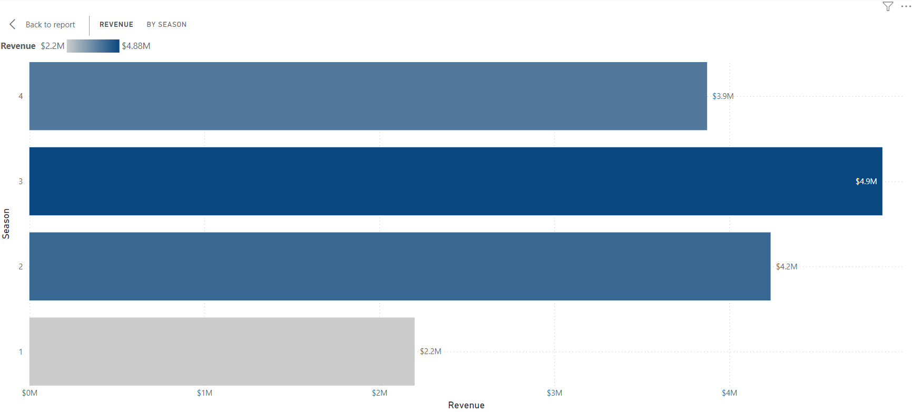
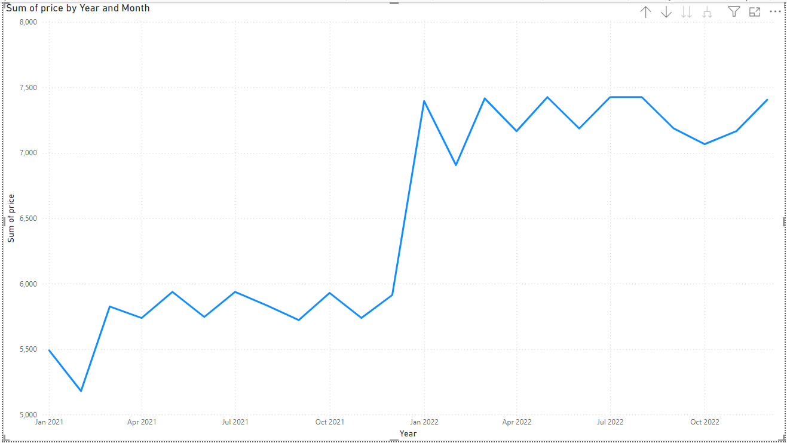
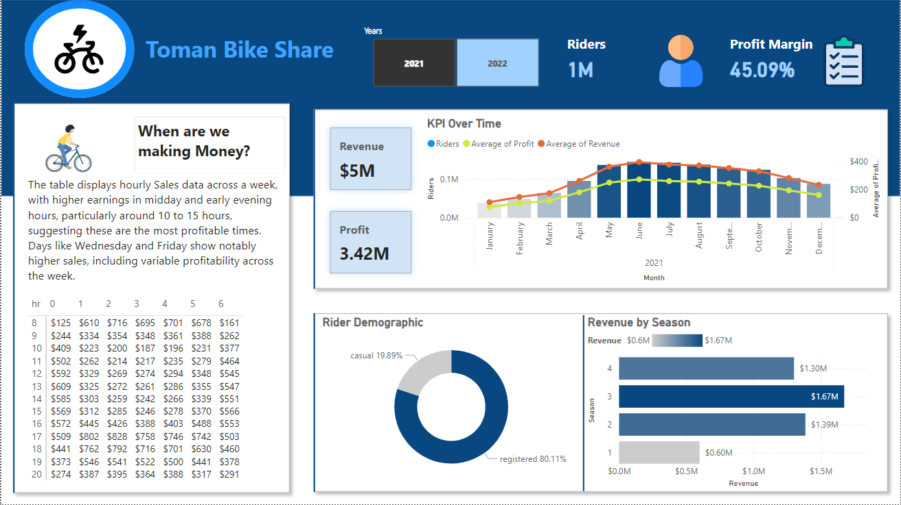
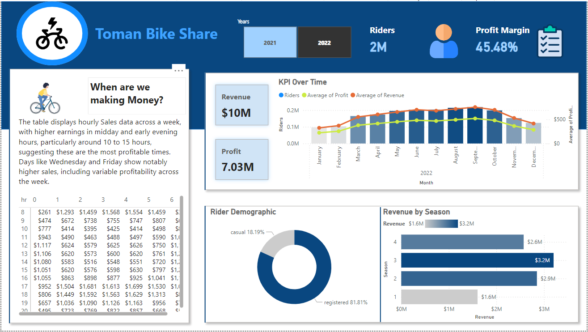

# Toman Bike Share Price Analysis Report

## Introduction
As a Data Analyst for Toman Bike Share, the primary focus of this project is to assess the feasibility of increasing prices for the upcoming year. Utilizing a comprehensive dataset provided by the company, this project involves building a database, developing SQL queries to extract and analyze key data, and creating an interactive Power BI dashboard. The aim is to provide a data-driven basis for pricing decisions, ensuring that the company's strategy aligns with market conditions and customer behavior.
## Objective
The objective of this project is to analyze Toman Bike Share's data to determine whether an increase in pricing for the next year is viable. The analysis will explore current pricing structures, customer demographics, ride patterns, and revenue data. By identifying trends and patterns, the project seeks to provide actionable recommendations for pricing adjustments that maximize revenue without negatively impacting customer satisfaction and usage.
## Overview
This project focuses on developing an interactive dashboard for "Toman Bike Share" to visualize key performance metrics. The dashboard will facilitate informed decision-making by providing insights into hourly revenue, profit trends, seasonal revenue, and rider demographics. The data is sourced from a SQL Server database and analyzed using Power BI.
## Project Structure & Task

1. Build a Database

2. Develop SQL queries 

3. Connect Power BI to your database

4.  Build a Dashboard 

5.  Make Analysis Recommendations

## Data & Resource Used

**Dataset**

Option 1: [Kaggle](https://www.kaggle.com/datasets?fileType=csv)

Option 2: And, also the dataset can be found on [Absent Data](https://www.youtube.com/@absentdata) YouTube Channel. I am grateful for his guidance on this project.

**Tools and Technologies** 

•	Power BI Function Library: SQL, and DAX

•	Tool: Microsoft Excel, SQL Server, and Power BI

## Methodology
A. **Build a Database**

o Set up a relational database to store Toman Bike Share's data, including ride history, customer information, pricing details, and operational metrics.

B. **Develop SQL Queries**

o Write SQL queries to clean, manipulate, and extract relevant data from the database. This includes calculating key metrics such as average revenue per ride, customer segmentation, and peak usage times.

C. **Connect Power BI to the Database**

o Establish a connection between the database and Power BI to facilitate the real-time updating and visualization of data.

D. **Build a Dashboard**

o Create a Power BI dashboard that visualizes key metrics and trends. The dashboard will include charts and graphs illustrating revenue, ride frequency, customer demographics, and other critical factors influencing pricing decisions.

E. **Make Analysis Recommendations**

o Based on the data analysis, provide recommendations regarding potential pricing changes, taking into account factors such as customer elasticity, competitive pricing, and seasonal demand variations.

## Data Analysis
**Evaluate whether we can raise the prices for the upcoming years which was our central question.**

**Insight:**

We can see that we raise the price by a dollar and then we saw that gigantic increase in profit and gigantic increase in Riders.

If our riders were able to sustain a pretty sizable increase in our price also increase in Rider’s year on year that pretty good and profit also there is no change so let's get into some analysis calculation.

Calculate our change in Price 4.99 – 3.99 = 1 /3.99 = 0.25. So, 25% increase in price and also, we saw a gigantic jump in our Revenue.

Demand of the riders as our profit 2049576 – 1243103 = 806473 / 1243103 = 0.64. So, 64% increase in rider’s count.

Obviously, if we increase the price by 25% and we still saw the increase of 64% we can feel with a pretty high degree of confidence that if we increase the price a little bit more and it should not affect demand now that assuming everything works in a linear way and there is a metric the people use used to kind of usually understand that prices in something called elasticity. 

0.65/0.25 = 2.6/0.25=10.4

64/25=2.56

2.56 price elasticity can tolerate an increase usually this number is negative saying that if we increase the price that demand will go down by 2.56 but however in our case it goes up so there are obviously other things that play but it's pretty clear we can increase the price very conservatively.

## Data Visualization & Key Findings
### Revenue by Season
**Insight:** The analysis indicates that Season 3 consistently generated the highest revenue in 2021 and 2022, compared to other seasons. This insight can guide marketing and operational decisions, such as optimizing resources during peak periods.

### Sum of Price by Month

**Insight:** After price increase there is no decline in riders count and revenue.

### Toman Bike Share 2021 Dashboard

### Toman Bike Share 2022 Dashboard

## Conclusion
The Toman Bike Share Performance Dashboard provides a comprehensive view of the company's financial and operational metrics. By leveraging data from the SQL Server database and visualizing it in Power BI, the project enables Toman Bike Share to make data-driven decisions to enhance profitability and optimize operations. The recommendations provided aim to capitalize on identified trends and improve overall business performance.
## Recommendations
A. **Conservative Increase:**

o Consider a conservative increase in pricing or capacity during peak seasons to maximize revenue without overwhelming resources.

o Considering the substantial increase last year, a more conservative increase might be prudent to avoid hitting a price ceiling where demand starts to drop. An increase in the range of 10-15% could test the market’s response without risking a significant loss of customers.

B. **Price Setting:**

o Implement a segmented pricing strategy that reflects the demand and rider demographics, potentially offering discounts during off-peak hours or to specific rider categories.

o If the price in 2022 was $4.99, a 10% increase would make the new price about $5.49.

o A 15% increase would set the price at approximately $5.74.

C. **Recommended Strategy:**

**Market Analysis:**

o Conduct a thorough market analysis to understand competitive pricing and service offerings.

o Conduct further market research to understand customer satisfaction, potential competitive changes, and the overall economic environment. This can guide weather learning towards the lower or higher end of the suggested increase.

**Segmented Pricing Strategy:**

o Tailor pricing based on rider segments and usage patterns, ensuring that pricing is competitive yet profitable.

o Consider different pricing for casual versus registered users, as they may have different price sensitivities.

**Monitor and Adjust:**

o Continuously monitor revenue and profit metrics, adjusting strategies in response to market conditions and rider feedback.

o Implement the new prices but be ready to adjust based on immediate customer feedback and sales data. Monitoring closely will allow you to find-tune your pricing strategy without committing fully to a price that might turn out to be too high.
## Reflection
This project underscored the importance of thorough data preparation and analysis in making informed business decisions. The integration of SQL and Power BI proved effective in not only managing and analyzing large datasets but also in presenting complex data in an accessible and actionable format. The insights gained from this analysis will be instrumental in guiding Toman Bike Share's pricing strategy. Going forward, continued refinement of data models and the inclusion of additional variables will enhance the accuracy and utility of the analysis.
